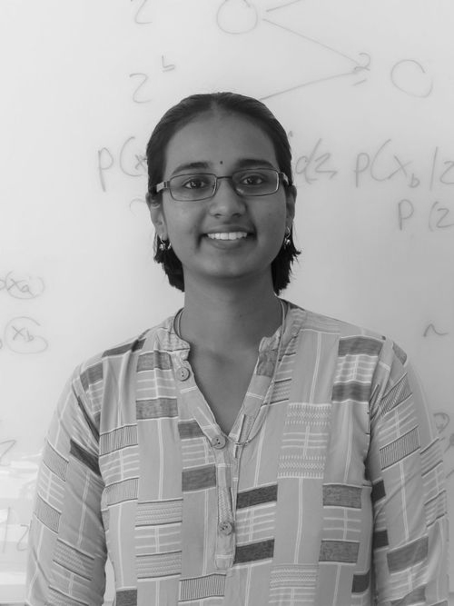

<!--img src="{{ './PoornimaRamesh.jpeg' | prepend: site.baseurl }}" id="about-img"-->

	
I work on applying machine learning techniques, specifically Generative Adversarial Networks (GANs), to applications in simulation-based inference and neuroscience in the <strong><a href="https://uni-tuebingen.de/fakultaeten/mathematisch-naturwissenschaftliche-fakultaet/fachbereiche/informatik/lehrstuehle/machine-learning-in-science/start/"> Machine Learning for Science</a></strong> group

	<!-- 
Fork and use the theme from the <strong> <a href="https://github.com/knhash/Pudhina"> repository</a> </strong>
 -->

